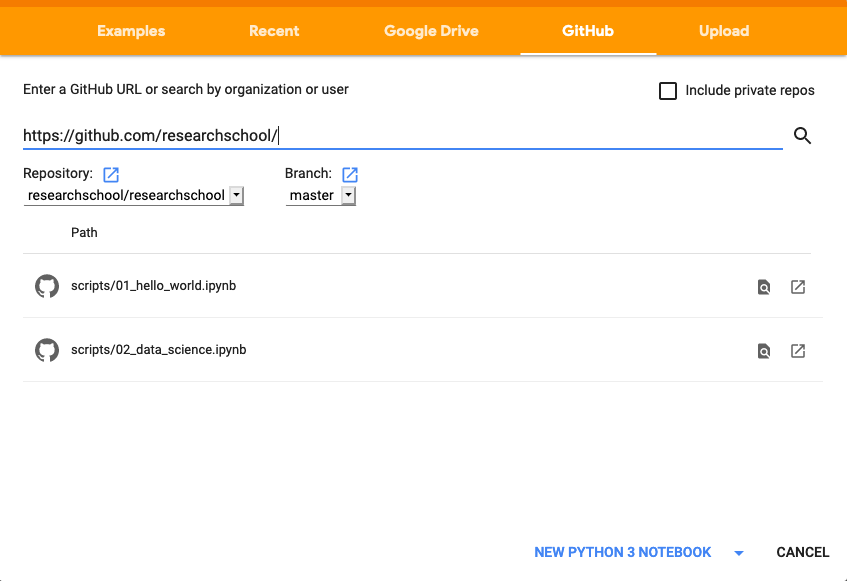

#### Lessons

The following lessons will be taught with the help of [Google colaboratory][1] and [Jupyter][2]. 

**To get started:**
1. Open [Google colaboratory][1]
2. Once inside the notebook, click "Github" at the top and type this in the search url: 
    
    https://github.com/researchschool/researchschool

3. You should see the following screen, where you can select the script to open.

**Lessons:**

- Lesson 1: Introduction to programming with Python.
- Lesson 2: Introduction to genomics.
- Lesson 3: Studying cancer with python.

Further information and slides available soon.

[1]: https://colab.research.google.com/
[2]: https://jupyter.org/